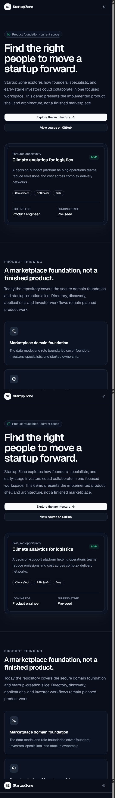

# Startup Zone

Startup Zone is a marketplace MVP where founders publish projects, specialists find teams, and investors discover early-stage startups.

**[Open the public demo](https://startup-zone-danilyoh.vercel.app)** — the hosted version is read-only. Authentication and startup creation require a configured Supabase environment.



## Current scope

Implemented:

- Supabase authentication and protected founder dashboard;
- persisted startup creation with server-side Zod validation;
- filterable public startup directory and detail pages;
- PostgreSQL constraints and row-level security with pgTAP tests;
- responsive light and dark UI;
- Vitest, Playwright, and GitHub Actions coverage for core flows.

Planned: profile editing, specialist and investor applications, application moderation, broader end-to-end coverage, and production observability.

## Stack

Next.js 16, React 19, strict TypeScript, Mantine UI, Tailwind CSS, Supabase Auth and PostgreSQL, Zod, Vitest, pgTAP, and Playwright.

Server Components handle reads, Server Actions handle validated mutations, and PostgreSQL RLS enforces ownership independently of the UI.

## Run locally

Requires Node.js 20.9+ and a local or test Supabase project.

```bash
git clone https://github.com/DanilYoh/startup-zone.git
cd startup-zone
npm ci
cp .env.example .env.local
npm run dev
```

Set `NEXT_PUBLIC_SUPABASE_URL` and `NEXT_PUBLIC_SUPABASE_PUBLISHABLE_KEY` in `.env.local`, then apply the migrations from `supabase/migrations/`. Open [http://localhost:3000](http://localhost:3000).

Never use production Supabase credentials for local development or tests.

## Checks

```bash
npm run check
npm run build
npm run test:coverage
npm run test:rls
npm run test:e2e
```

`npm run check` runs linting, type-checking, and unit tests. RLS and E2E tests require a local or explicitly designated test Supabase environment; E2E also requires `SUPABASE_SERVICE_ROLE_KEY`.

## Author

[DanilYoh](https://github.com/DanilYoh)
