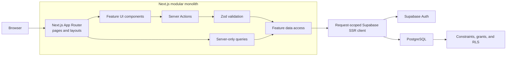

# Startup Zone architecture

## Status and scope

This document is the architectural baseline for Startup Zone. New work should
follow it, and changes that intentionally alter these decisions should update
this document in the same commit.

Startup Zone is a modular monolith: one Next.js application and one Supabase
project, organized into product-focused vertical slices. This keeps the MVP
simple to operate while giving profiles, startups, and applications explicit
module boundaries.

The active marketplace has exactly two product roles: founders and investors.
Founders publish startups and decide incoming investment interest. Investors
describe their mandate, discover persisted startups, and send interest
requests. The historical `specialist` database enum label is retained only so
already-applied databases do not require destructive record rewriting; new
onboarding, inserts, authorization policies, queries, and UI flows reject it.

The current repository is being moved toward the target structure
incrementally. Existing code does not need to be relocated in a standalone
refactor; move it when the related feature is changed and the move helps deliver
that feature safely.

## System overview



The Next.js application is the backend-for-frontend. Do not add a separate API
service between Next.js and Supabase unless a demonstrated requirement cannot
be met safely in the existing application.

## Target repository structure

```text
app/
  (public)/                    # Public discovery and landing routes
  (auth)/                      # Sign-in, sign-up, and recovery routes
  (dashboard)/                 # Authenticated product routes and layouts
  layout.tsx
  globals.css

features/
  auth/
    components/
    server/
      actions.ts
      queries.ts
    schemas.ts
    types.ts
  profiles/
    components/
    server/
      actions.ts
      permissions.ts
      queries.ts
    schemas.ts
    types.ts
  startups/
    components/
    server/
      actions.ts
      permissions.ts
      queries.ts
    constants.ts
    schemas.ts
    types.ts
  applications/
    components/
    server/
      actions.ts
      permissions.ts
      queries.ts
    schemas.ts
    types.ts
  legal/
    components/                  # Public privacy and consent documents
    server/
      config.ts                  # Fail-closed runtime legal configuration
    types.ts

components/
  layout/                      # Shared application chrome
  ui/                          # Domain-neutral reusable UI

lib/
  supabase/
    client.ts
    proxy.ts
    server.ts
    types.ts
  env.ts                       # Environment parsing and capability checks
  errors.ts                    # Stable shared error primitives
  logger.ts                    # Safe server-side logging

supabase/
  migrations/
  tests/database/
  seed.sql

tests/
  unit/
  e2e/
```

Route groups organize layouts without affecting URLs. The exact URL hierarchy
is a product decision; feature modules must not depend on route folder names.

## Responsibilities and dependency rules

### `app/`

- Defines routes, layouts, metadata, loading states, error boundaries, and page
  composition.
- Uses Server Components by default.
- Calls feature queries for reads and renders feature components.
- Contains minimal domain logic. A page should orchestrate a use case rather
  than implement it.

### `features/`

- Owns product behavior by domain: authentication, profiles, startups, and
  applications.
- Keeps feature-specific UI, validation, types, permissions, reads, and
  mutations together.
- Places database reads in `server/queries.ts` and UI-driven mutations in
  `server/actions.ts`.
- Marks server-only modules with `import "server-only"` where they are not
  already protected by a `"use server"` boundary.
- Avoids importing another feature's internal components or server files.
  Cross-domain workflows belong to the feature that owns the use case and may
  read the required database records through its own server module.

### `components/`

- Contains only domain-neutral UI primitives and shared application chrome.
- Must not fetch data or contain authorization rules.
- Feature-specific components stay in their feature module even if more than
  one route uses them.

### `lib/`

- Contains infrastructure shared across multiple features.
- Must not become a catch-all folder for product behavior.
- May not import from `app/` or `features/`.
- Keeps browser and server Supabase clients separate. A server client is created
  for each request and is never stored globally.

The intended dependency direction is:

```text
app -> features -> shared components/lib
```

Client Components must never import modules from `features/*/server` or
`lib/supabase/server.ts`.

## Request and data flows

### Reads

1. A Server Component receives route parameters or search parameters.
2. It normalizes untrusted parameters through a feature schema or parser.
3. It calls a server-only feature query.
4. The query creates a request-scoped Supabase server client and selects only
   the columns needed by the view.
5. The page renders an explicit ready, empty, unconfigured, not-found, or error
   state.

Client-side data fetching is reserved for browser-specific interaction such as
realtime updates. It is not the default for initial page data.

### Mutations

1. A form or interaction invokes a feature Server Action.
2. The action treats every argument as untrusted, verifies the current user,
   and performs role and ownership checks.
3. Zod validates and normalizes the submitted data.
4. Ownership fields are derived from the verified session, never from submitted
   input.
5. The action performs the smallest necessary database mutation.
6. PostgreSQL constraints, column grants, and RLS independently enforce the
   allowed operation.
7. The action returns a stable user-facing result or revalidates and redirects
   after success. Raw database and Auth errors are not exposed.

Server Actions are public mutation boundaries, not trusted internal functions.
Route Handlers are used only when an HTTP endpoint is required, such as a
webhook, external integration, file response, or public API.

## Security and data integrity

### How row-level security works here

The publishable browser key identifies the Supabase project; it is not an
authorization bypass. PostgreSQL evaluates RLS for every Data API operation
using the authenticated user's JWT claims. Policies combine `auth.uid()` with
the immutable profile role, startup ownership, application state, and explicit
contact-sharing consent. Server-side role checks provide a useful error, while
RLS repeats the decision so a direct API call or UI defect cannot widen access.
Service-role credentials bypass RLS and therefore exist only in guarded
operator scripts and isolated test setup, never in the application runtime.

- PostgreSQL constraints and RLS are the final authorization boundary. Route
  protection and hidden controls are defense-in-depth.
- Authorization is enforced twice for sensitive operations: explicitly in
  server code for a useful response and independently in the database.
- Role, ownership, writable-column, and state-transition rules remain aligned
  across migrations, generated database types, domain constants, Zod schemas,
  server code, UI states, and tests.
- Applied migrations are immutable. Schema changes use additive migrations.
- The browser receives only the data required for the current view.
- Anonymous clients cannot read `profiles`. Public startup pages resolve founder
  attribution through the deliberately narrow `public_founder_profiles` view,
  which exposes only an id, display name, professional headline, founder
  experience, and location for founders with an active startup.
- Private email and contact links live in `profile_contacts`, outside the wider
  profile-read policy. RLS permits the owner to manage that record and reveals
  an explicitly enabled contact to the other participant only after an
  investor-interest request reaches the terminal `accepted` state.
- Signup presents personal-data consent separately from other account fields and
  submits an exact legal-document version. The Server Action validates that
  version against runtime configuration and sends only the server-selected
  version to Auth. The Auth database trigger independently requires that version
  to be active before it creates a marketplace profile.
- `legal_consents` stores the subject id, normalized signup email, document
  version, source, and a database-generated acceptance timestamp. Consent rows
  are immutable, readable only by their subject through RLS, and have no browser
  write grant. They intentionally have no cascading Auth foreign key so account
  deletion cannot silently erase evidence; the operator's approved retention
  policy must define eventual evidence deletion.
- Closed-beta access uses `beta_invitations`, which stores only a SHA-256 code
  hash plus the invited email, role, expiry, and consumption state. The raw code
  exists only in the operator's one-time CLI output. A narrow anonymous RPC
  pre-validates the high-entropy hash tuple so the form can return a stable
  expected error without exposing the table. The Auth trigger then locks the
  matching unused row, verifies email, role, and expiry, and consumes it in the
  same transaction that creates the profile and legal-consent evidence. Direct
  Auth calls cannot bypass this boundary, and browser roles have no table grant.
- Collection reads use server-validated page numbers, stable ordering, bounded
  database ranges, and an exact count. They never rely on a silent terminal
  `limit` or load an unbounded dashboard history.
- Logs contain safe error codes and operational context, not secrets, tokens,
  raw credentials, or unnecessary personal data.
- Proxy creates an unpredictable nonce for each HTML request and forwards the
  same value to rendering and the response CSP. Executable scripts and generated
  style elements require that nonce; the narrower `style-src-attr` compatibility
  exception exists only for Mantine's component CSS custom properties.
- Production Supabase data is never accessed or changed without explicit,
  task-specific approval.

Role-specific profile fields keep identity separate from decision context.
Founder credibility belongs to the founder profile while product, market,
stage, links, and funding intent belong to the startup record. Investor
organization, thesis, preferred stages, and ticket range belong to the investor
profile. The complete field rationale is documented in
[`profile-structure.md`](profile-structure.md).

## Feature delivery standard

Build every capability as a complete vertical slice. A slice is complete only
when it includes:

- a reachable interface for the intended role;
- real reads or persistence rather than hard-coded product data;
- server-side validation, authentication, and authorization;
- database constraints and RLS when data behavior changes;
- loading, empty, success, validation, authorization, conflict, and unexpected
  error states as applicable;
- unit tests for pure rules, pgTAP tests for positive and negative database
  authorization, and Playwright coverage for critical user journeys;
- documentation that describes verified current behavior and limitations.

Prefer a small complete workflow over several partial screens.

## Testing boundaries

- Vitest covers schemas, parsers, formatting, routing helpers, and other pure
  domain behavior.
- Vitest with React Testing Library covers synchronous Client Components,
  accessible UI states, and user interactions with server boundaries mocked.
  Complete Server Action and async Server Component behavior stays in
  Playwright.
- pgTAP and the Supabase CLI cover constraints, grants, RLS, ownership, roles,
  and allowed state transitions.
- Playwright covers critical journeys across UI, authentication, server logic,
  and persistence using only a local or explicitly designated test environment.
- Browser verification supplements automated checks for responsive layout,
  themes, keyboard operation, visible focus, and meaningful failure states.
- Coverage reports include all executable files under `app`, `components`,
  `features`, and `lib` (except generated database types), including untested
  files at zero percent. The global threshold is a regression floor, not a
  claim that database, Server Action, or end-to-end behavior is unit-tested.

## Evolution rules

- Keep the modular monolith until operational or scaling evidence justifies a
  service boundary.
- Do not add generic repository, service, event-bus, or dependency-injection
  layers without a concrete use case.
- Extract shared code only after it has a stable meaning in multiple features.
- Introduce background jobs only for work that cannot safely complete within a
  request, such as durable retries or long-running processing.
- Add observability through Next.js instrumentation and structured server logs
  and keep product modules independent of a specific monitoring vendor. The
  release, monitoring, and recovery procedures are defined in
  [`docs/operations.md`](operations.md).

The alternatives and trade-offs behind the durable decisions in this document
are recorded in the [`adr/` decision log](adr/README.md).
