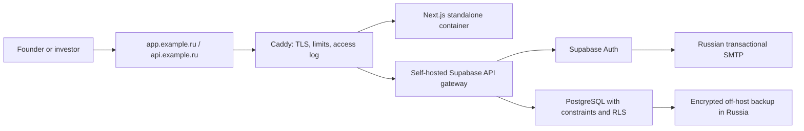

# Russia launch plan

## Decision

Launch Startup Zone as a curated, invitation-only marketplace for Russian B2B
and AI founders seeking their first angel or seed conversations. Do not add
payments, escrow, automated scoring, mobile applications, or broad social
features before the marketplace repeatedly creates qualified meetings.

The lowest-cost credible production topology is one Russian VPS running one
Next.js instance, the official self-hosted Supabase Docker bundle, and Caddy as
the only public ingress. This deliberately accepts a single-instance
availability risk during the closed beta. Encrypted backups must live outside
that VPS.

Supabase documents 2 CPU, 4 GB RAM, and 40 GB SSD as the minimum for the full
self-hosted stack, and recommends 4 CPU, 8 GB RAM, and 80 GB SSD for small and
medium production workloads. Start with the recommended size because the app,
database, Auth, API gateway, and build process share the machine. See the
[official self-hosting requirements](https://supabase.com/docs/guides/self-hosting/docker).

## Minimal monthly budget

Prices are a planning snapshot checked on 9 August 2026 and must be rechecked
before purchase.

| Item | Closed-beta choice | Expected cost |
| --- | --- | ---: |
| Russian VPS | 4 vCPU, 8 GB RAM, 80 GB SSD | about 1,100 RUB/month |
| Transactional email | Yandex Cloud Postbox, first 2,000 messages | 0 RUB/month at beta volume |
| Off-host encrypted backups | Russian object storage, short retention | 300-700 RUB/month |
| Domain | one `.ru` domain | about 300-1,000 RUB/year |
| Monitoring | provider health check plus operator alerts | 0-300 RUB/month |

The expected infrastructure floor is approximately **1,400-2,100 RUB/month**,
excluding taxes, a one-time legal review, and operator time. The current
[Selectel fixed VDS price list](https://selectel.ru/services/cloud/vps-vds/)
lists a 4 vCPU/8 GB/80 GB configuration at 1,100 RUB/month. The current
[Yandex Cloud Postbox pricing](https://yandex.cloud/ru/docs/postbox/pricing)
includes 2,000 outbound messages each month at no charge. Neither provider is a
hard architectural dependency; choose an equivalent Russian provider if its
contract, data location, support, or price is better.

## Production topology



Only ports 80 and 443 are public. PostgreSQL, Supabase Studio, and the raw API
gateway port stay private. The application container never receives a
service-role key. `NEXT_PUBLIC_*` values are public by design and are embedded
at image build time, so a production image must be built with the production
domains and publishable key.

## Legal and data gate

This section is an engineering launch gate, not legal advice. An identified
operator and qualified Russian counsel must approve the documents and data
flows before public signup.

- Identify the personal-data operator and support/security contacts.
- Inventory every collected field, purpose, legal basis, recipient, retention
  period, deletion path, and subprocesser.
- Keep the primary collection, storage, update, and retrieval databases for
  Russian citizens in Russia. Since 1 July 2025, the revised localization rule
  prohibits using databases outside Russia for those initial operations except
  for statutory exceptions; see the
  [Ministry of Digital Development clarification](https://www.consultant.ru/document/cons_doc_LAW_511584/).
- File the required operator notification before processing unless counsel
  confirms a statutory exception. Use the
  [Roskomnadzor notification portal](https://pd.rkn.gov.ru/operators-registry/notification/form/).
- Publish approved privacy, consent, retention, deletion, and incident-response
  documents. Record consent with document versions; do not rely on a pre-ticked
  checkbox or acceptance hidden only in general terms.
- Avoid foreign analytics, error tracking, email, and support tools until their
  personal-data flows and any cross-border notification are approved.

The repository now provides separate `/legal/privacy` and `/legal/consent`
pages, a mandatory unchecked signup consent, immutable server-timestamped
version evidence, and a database trigger that rejects direct Auth signup without
an active version. These are engineering controls, not approved legal text.
Production registration fails closed until the operator's actual identity,
address, privacy contact, processors, approved non-draft document version, and
effective date are configured both in the database and application runtime.

## Deployment runbook

### 1. Provision and harden the VPS

Use a supported Linux distribution in a Russian data center. Create a
non-root operator, require SSH keys, disable password login, enable unattended
security updates, and allow inbound traffic only on SSH from an operator IP plus
public TCP 80/443 and UDP 443. Docker-published Supabase ports require explicit
`DOCKER-USER` firewall rules; verify from an external host that 5432, 8000,
8443, and Studio are unreachable.

Install Docker Engine and the Compose plugin. Create separate directories for
the reviewed Supabase bundle and this repository. Pin Supabase to a reviewed
release instead of tracking its default branch. Configure unique production
secrets, a Russian SMTP endpoint, the application/API origins, Auth redirect
allowlists, and email confirmation according to the
[official self-hosting guide](https://supabase.com/docs/guides/self-hosting/docker).
Do not enable the optional logging/analytics stack on the first VPS; official
Supabase documentation notes that it increases resource use.

The Supabase gateway can listen on host port 8000 for the Caddy container via
`host.docker.internal`, but the port must be denied externally. A shared Docker
network with no published gateway port is preferable once it has been verified
against the pinned Supabase Compose release.

### 2. Apply the database without application traffic

From an approved operator machine, use a percent-encoded direct production
database URL held in a secret manager:

```bash
npx supabase db push --db-url "$DATABASE_URL" --dry-run
npx supabase db push --db-url "$DATABASE_URL"
```

Review the dry run and take an encrypted backup before applying migrations.
Never use a production URL in local tests. Run pgTAP and Playwright against an
isolated staging clone before repeating the approved production rollout.

The repository seed activates only `local-development-v1` for local and test
work. Before production, counsel must approve the operator-specific texts and an
additive migration must insert and activate their exact version. Confirm that
the database has exactly one active approved version before deploying the
matching runtime configuration; see the activation procedure in
[`operations.md`](operations.md#production-legal-document-activation).

### 3. Build and start the application edge

Create an untracked `.env.production` on the VPS:

```dotenv
APP_DOMAIN=app.example.ru
SUPABASE_DOMAIN=api.example.ru
SUPABASE_UPSTREAM=host.docker.internal:8000
NEXT_PUBLIC_SUPABASE_URL=https://api.example.ru
NEXT_PUBLIC_SUPABASE_PUBLISHABLE_KEY=replace-with-production-publishable-key
NEXT_PUBLIC_SITE_URL=https://app.example.ru
APP_ENVIRONMENT=production
RELEASE_VERSION=replace-with-immutable-git-sha
LEGAL_DOCUMENT_APPROVED=true
LEGAL_DOCUMENT_VERSION=replace-with-approved-non-draft-version
LEGAL_DOCUMENT_EFFECTIVE_DATE=2026-08-09
LEGAL_OPERATOR_NAME=replace-with-legal-name-or-full-name
LEGAL_OPERATOR_ADDRESS=replace-with-operator-address
LEGAL_OPERATOR_EMAIL=privacy@example.ru
LEGAL_PROCESSORS=replace-with-russian-vps-provider; replace-with-russian-email-provider
```

Use the real effective date and the exact version activated by the approved
migration. Keep registration disabled if legal review, the Roskomnadzor filing,
or any operator detail is incomplete.

Then deploy the reviewed commit:

```bash
docker compose --env-file .env.production -f compose.production.yaml build --pull
docker compose --env-file .env.production -f compose.production.yaml up -d
docker compose --env-file .env.production -f compose.production.yaml ps
curl --fail --silent --show-error https://app.example.ru/healthz
```

Caddy obtains and renews TLS certificates after both DNS records point to the
VPS. The checked-in configuration caps request bodies at 1 MB because the MVP
does not accept uploads. Raise that limit only together with an authenticated
upload flow and storage-specific abuse controls.

### 4. Verify before inviting users

- Confirm signup and email confirmation for founder and investor accounts.
- Confirm profile persistence and that roles cannot be changed.
- Publish and deactivate a startup; verify public directory behavior.
- Submit, accept, and reject investor interest.
- Confirm private contacts remain hidden before acceptance and become visible
  to both accepted participants only when sharing is enabled.
- Verify dark/light themes and a 390-pixel mobile viewport.
- Verify structured logs, external availability alerts, daily backup creation,
  and a restore into an isolated database.

Keep the previous reviewed Git commit available. Roll back the application by
rebuilding that commit; do not roll back an applied database migration unless a
separately reviewed forward fix cannot restore service and a tested restore has
been explicitly approved.

## Market-entry sequence

### Weeks 1-2: make the beta legally and operationally launchable

- Complete operator identification, legal review, Roskomnadzor filing, approved
  document-version activation, and production configuration. The consent flow
  itself is implemented and covered by unit, database, and browser tests.
- Deploy staging, run the complete release gate, then deploy the reviewed
  production candidate with explicit approval.
- Translate the acquisition and core marketplace paths into Russian and show
  ticket sizes in RUB while retaining the stored numeric model.
- Create one support channel and a manual moderation checklist. Do not build an
  admin panel yet.

### Weeks 3-6: manually create liquidity

- Recruit 20 curated B2B/AI founders and 10 active angels or seed investors
  through direct outreach, accelerator communities, and warm introductions.
- Interview and manually review every founder before publishing. Help each one
  sharpen the problem, traction, ask, and contact path.
- Send investors a weekly digest assembled manually from live records. Do not
  add bulk-email automation before the format repeatedly drives meetings.
- Personally follow every accepted request until a meeting happens or the
  reason for failure is recorded without unnecessary personal data.

Acquisition spending is capped at 10,000 RUB total during this phase. Prefer
founder communities, university accelerators, regional innovation centers, and
partner newsletters over paid performance advertising.

### Weeks 7-10: improve only the measured bottleneck

Prioritize the first bottleneck supported by evidence:

1. low-quality listings: add stronger required evidence and manual review;
2. poor discovery: improve filters and investor thesis matching;
3. ignored requests: add transactional reminders and response-time reporting;
4. accepted requests without meetings: improve contact handoff and follow-up.

Do not expand beyond the initial founder segment until at least 30% of active
startups receive a qualified request and at least 25% of accepted requests
produce a confirmed meeting.

## Weekly scorecard and stop rules

Track only product outcomes that can be verified from persisted state plus a
small manual meeting log:

- active reviewed startups;
- active verified investors;
- qualified interest requests per active startup;
- median time to first qualified request;
- acceptance rate;
- accepted requests that produce a meeting;
- weekly founder and investor retention;
- infrastructure cost per active match.

After six beta weeks, continue the marketplace only if at least 10 qualified
requests, 5 accepted exchanges, and 3 confirmed meetings have occurred. If not,
pause feature development and change the segment, sourcing method, or value
proposition based on interviews. Do not buy traffic to conceal a liquidity or
quality problem.

## Remaining blockers to a real production launch

- the operator's legal identity, approved privacy documents, their production
  version/effective date, and the Roskomnadzor notification decision are still
  external inputs; the repository's versioned consent capture is implemented;
- a Russian VPS, domain, SMTP account, and backup destination have not been
  purchased or configured;
- no external monitoring backend or verified production alert route exists;
- no production data or production Supabase environment has been accessed,
  which is intentional until task-specific approval is given.
